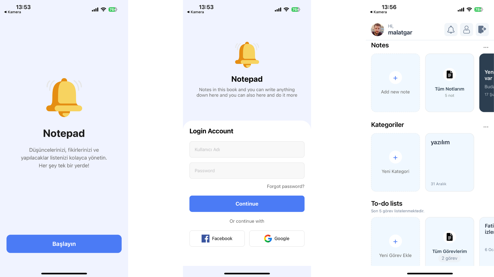
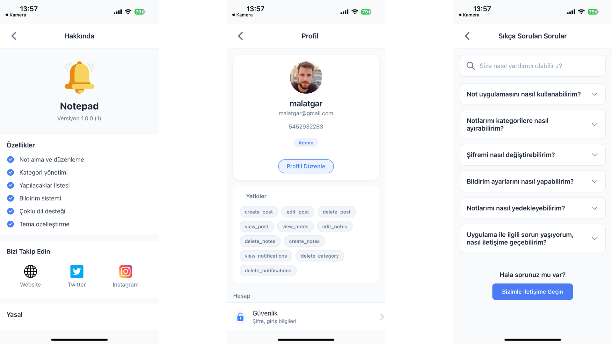
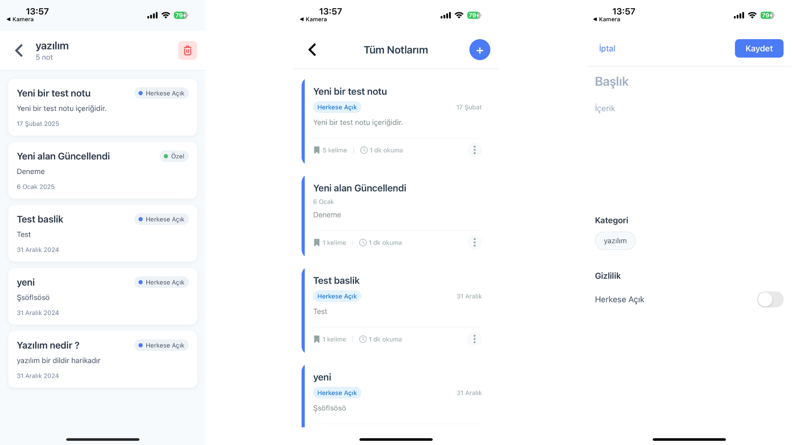
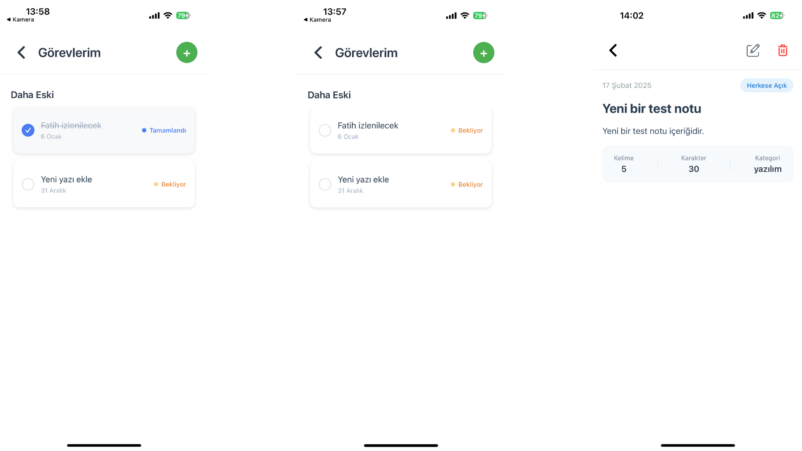

# 📱 Notepad Mobile App

A modern and user-friendly note-taking application built with React Native and TypeScript.

## ✨ Features

- 📝 Note Management (Create, Edit, Delete)
- 📂 Category Organization
- ✅ Todo List Management
- 👤 User Authentication
- 🔔 Push Notifications

## 🛠️ Tech Stack

- React Native
- TypeScript
- React Navigation
- Context API
- Axios
- AsyncStorage

### Backend
- PHP 8.1
- MySQL 8.0
- RESTful API
- JWT Authentication
- Apache Server

## 🚀 Installation

1. Clone the repository
2. Install dependencies: `npm install`
3. iOS setup: `cd ios && pod install`
4. Run the app:
   ```bash
   # iOS
   npm run ios

   # Android
   npm run android
   ```


# 📱 Not Tutma Uygulaması

React Native ve TypeScript ile geliştirilmiş modern bir not tutma uygulaması.

## ✨ Özellikler

- 📝 Not Yönetimi (Oluşturma, Düzenleme, Silme)
- 📂 Kategori Organizasyonu
- ✅ Yapılacaklar Listesi
- 👤 Kullanıcı Kimlik Doğrulama
- 🔔 Anlık Bildirimler

## 🛠️ Teknolojiler

- React Native
- TypeScript
- React Navigation
- Context API
- Axios
- AsyncStorage

### API tarafı

- PHP 8.1
- MySQL 8.0
- RESTful API
- JWT Authentication
- Apache Server

## 🚀 Kurulum

1. Repoyu klonlayın
2. Bağımlılıkları yükleyin: `npm install`
3. iOS kurulumu: `cd ios && pod install`
4. Uygulamayı çalıştırın:
   ```bash
   # iOS
   npm run ios

   # Android
   npm run android
   ```

## 📱 Ekran Görüntüleri





